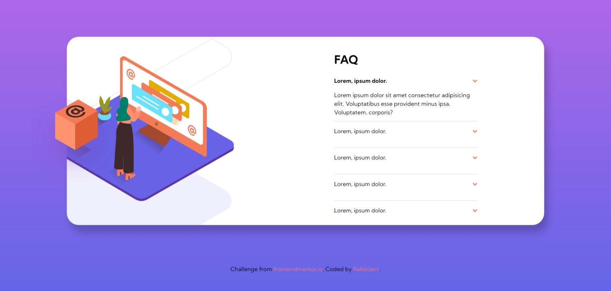

# Frontend Mentor - FAQ accordion card solution

This is a solution to the [FAQ accordion card challenge on Frontend Mentor](https://www.frontendmentor.io/challenges/faq-accordion-card-XlyjD0Oam). Frontend Mentor challenges help you improve your coding skills by building realistic projects. 

## Table of contents

- [Overview](#overview)
  - [The challenge](#the-challenge)
  - [Screenshot](#screenshot)
- [My process](#my-process)
  - [Built with](#built-with)
  - [What I learned](#what-i-learned)
  - [Continued development](#continued-development)

## Overview

### The challenge

Users should be able to:

- View the optimal layout for the component depending on their device's screen size
- See hover states for all interactive elements on the page
- Hide/Show the answer to a question when the question is clicked

### Screenshot

## My process

### Built with

- Semantic HTML5 markup
- CSS custom properties
- Flexbox
- Mobile-first workflow
- SASS
- JavaScript

### What I learned

I had some problems with getting just the box to overflow and not
the women or the pattern in the desktop version.
I solved this by getting the cube out of the modal and making the overflow
of the last to be hidden.
Then I got the cube where I wanted with a position relative.
Not sure it was the most effective way though, feel free to send some feddback.

### Continued development

I definitely want to keep playing around with the z-index property and see what
amazing web designs I can build.