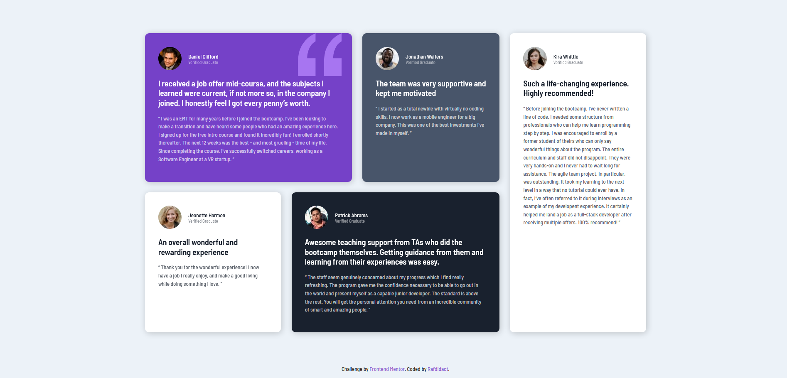

# Frontend Mentor - Testimonials grid section solution

This is a solution to the [Testimonials grid section challenge on Frontend Mentor](https://www.frontendmentor.io/challenges/testimonials-grid-section-Nnw6J7Un7). Frontend Mentor challenges help you improve your coding skills by building realistic projects. 

## Table of contents

- [Overview](#overview)
  - [The challenge](#the-challenge)
  - [Screenshot](#screenshot)
- [My process](#my-process)
  - [Built with](#built-with)
  - [What I learned](#what-i-learned)
- [Author](#author)

## Overview

### The challenge

Users should be able to:

- View the optimal layout for the site depending on their device's screen size

### Screenshot

## My process

### Built with

- Semantic HTML5 markup
- CSS custom properties
- Flexbox
- CSS Grid
- Mobile-first workflow
- SASS

### What I learned

This challenge made me use the grid-areas property on CSS Grid. One of my first encounters with CSS Grid, definitely a powerful tool.

## Author

- Website - [Rafdidact](https://rafdidact.github.io)
- Frontend Mentor - [@rafdidact](https://www.frontendmentor.io/profile/rafdidact)
- Twitter - [@rafdidact](https://www.twitter.com/rafdidact)
